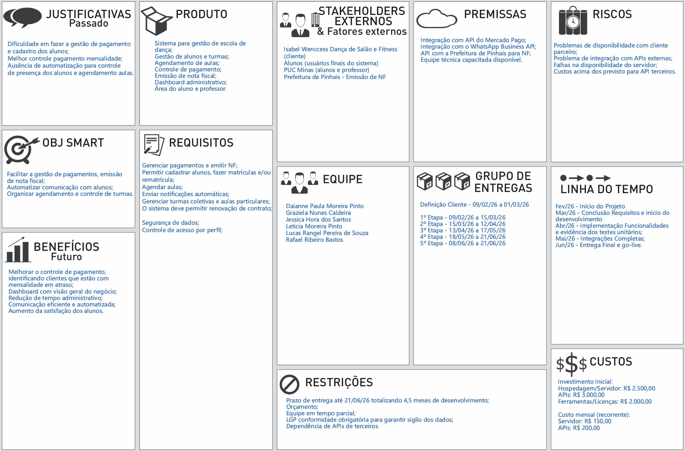
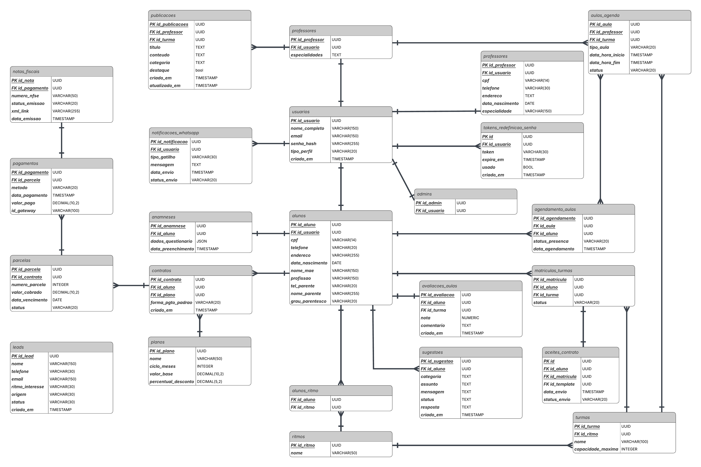
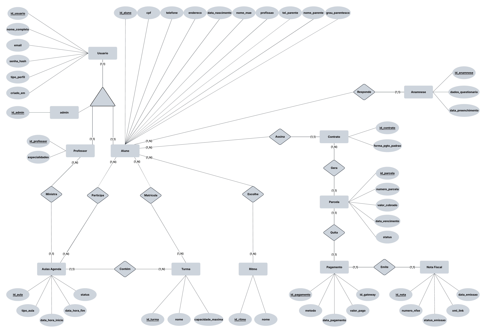

# Especificações do Projeto

<span style="color:red">Pré-requisitos: <a href="01-Documentação de Contexto.md"> Documentação de Contexto</a></span>

Definição do problema e ideia de solução a partir da perspectiva do usuário. 

## Usuários

| Tipo | Descrição | Responsabilidades |
|-----|-----|-----|
| **Administrador** | Gestor do estúdio. Opera o sistema no dia a dia. | • Cadastrar e editar alunos com ficha completa (dados pessoais, endereço, emergência, dados clínicos)<br>• Criar turmas, ritmos e professores<br>• Gerenciar matrículas, presenças e lista de espera<br>• Lançar, estornar e acompanhar pagamentos<br>• Gerar cobranças PIX via Mercado Pago<br>• Emitir e cancelar Notas Fiscais de Serviço (NFS-e) pela prefeitura de Pinhais<br>• Enviar mensagens e cobranças via WhatsApp — individual ou em massa<br>• Monitorar dashboard financeiro, inadimplentes e receita mensal<br>• Gerenciar leads, promoções e campanhas<br>• Configurar dados e parâmetros da empresa<br>• Configurar integrações (Mercado Pago, NFS-e, WhatsApp)<br>• Acessar todas as telas e funcionalidades |
| **Aluno** | Usuário final do estúdio. Pode se auto-cadastrar pelo site ou ser cadastrado pelo administrador. | • Preencher ficha de cadastro em etapas (dados pessoais, endereço, contato de emergência, dados clínicos, senha de acesso)<br>• Visualizar turmas em que está matriculado<br>• Acompanhar histórico e status de pagamentos<br>• Confirmar ou recusar presença em aula via WhatsApp<br>• Adicionar turmas à lista de desejos<br>• Agendar aula experimental ao concluir o cadastro<br>• Consultar ofertas e descontos disponíveis |
| **Professor** | Usuário do sistema responsável por ministrar aulas e acompanhar suas turmas, com acesso restrito. | • Visualizar turmas atribuídas a ele<br>• Consultar lista de alunos por turma<br>• Acompanhar agenda de aulas<br>|
| **Lead** | Visitante interessado. Não possui conta. Gerado pelo quiz de ritmos ou formulário público de captação. | • Responder quiz para descobrir a turma ideal<br>• Informar nome, telefone e e-mail para contato<br>• Solicitar aula experimental gratuita<br>• Ser acompanhado pelo administrador no funil de conversão até virar aluno |


## Arquitetura e Tecnologias

Arquitetura do Sistema
O sistema será desenvolvido utilizando uma arquitetura web baseada em camadas, separando as responsabilidades entre interface do usuário (frontend), lógica de negócio (backend) e armazenamento de dados (banco de dados). Essa arquitetura facilita a manutenção, escalabilidade e integração com serviços externos.
O frontend será responsável pela interface de interação com alunos e administradores (professora), permitindo funcionalidades como cadastro de alunos, agendamento de aulas, escolha de planos e visualização de pagamentos.
O backend será responsável pelo processamento das regras de negócio, incluindo gerenciamento de agendamentos, controle de planos, integração com pagamentos e envio de notificações.
O sistema também contará com integrações externas, como o serviço de pagamentos do Mercado Pago para processar pagamentos via PIX e geração de cobranças. Além disso, será utilizada integração com a WhatsApp para envio automático de mensagens de confirmação de presença antes das aulas.
A emissão de notas fiscais poderá ser realizada por meio de integração com serviços de emissão de nota fiscal eletrônica compatíveis com o sistema fiscal brasileiro.

## Diagrama

<p align="center">
  
  <br>
  
</p>


## Tecnologias

| Camada | Tecnologia | Função |
|------|------|------|
| Frontend | HTML5 / CSS / JS puro | Interfaces admin, aluno, WhatsApp, NFS-e, Mercado Pago |
| API | Node | Runtime principal |
| Framework Web | Next.js | Roteamento automático e integração otimizada com APIs |
| Banco de Dados | PostgreSQL | Persistência relacional sem instalação |
| WhatsApp | @whiskeysockets/baileys | Protocolo WhatsApp Web via WebSocket |
| QR Code | qrcode | Geração de imagem do QR para autenticação WhatsApp |
| Criptografia | bcryptjs + crypto (nativo) | Hash de senhas SHA-256 |
| PIX | Mercado Pago API | Cobranças PIX com QR Code dinâmico |
| Nota Fiscal | AtendeNet / IPM | SOAP/XML — Prefeitura de Pinhais/PR |
| CORS | cors | Permissões de origem cruzada |

## Project Model Canvas

<br>

<p align="center">
  
  <br>
  <em>Project Model Canvas</em>
</p>


## Requisitos

As tabelas que se seguem apresentam os requisitos funcionais e não funcionais que detalham o escopo do projeto. Para determinar a prioridade de requisitos, aplicar uma técnica de priorização de requisitos e detalhar como a técnica foi aplicada.

Para mais informações, consulte os microfundamentos Fundamentos de Engenharia de Software e Engenharia de Requisitos de Software. 

### Requisitos Funcionais


| ID | Descrição do Requisito | Prioridade | Etapa | Responsável | Complexidade |
|----|------------------------|------------|-------|-------------|--------------|
| RF01 | Agendar aula experimental e realizar anamnese com o cliente | Alta | Backlog | Equipe Dev | Média |
| RF02 | Exibir agendamentos no dashboard (agenda do dia ou semana dos professores) | Alta | Backlog | Equipe Dev | Média |
| RF03 | Permitir busca de alunos | Alta | Backlog | Equipe Dev | Baixa |
| RF04 | Permitir cadastro de alunos | Alta | Backlog | Equipe Dev | Baixa |
| RF05 | Matricular alunos em aulas particulares ou turmas | Alta | Backlog | Equipe Dev | Média |
| RF06 | Vincular aluno ao ritmo escolhido | Média | Backlog | Equipe Dev | Baixa |
| RF07 | Permitir acesso do aluno à área pessoal | Alta | Backlog | Equipe Dev | Média |
| RF08 | Administrador gerenciar turmas de dança | Alta | Backlog | Equipe Dev | Média |
| RF09 | Administrador gerenciar aulas particulares | Alta | Backlog | Equipe Dev | Média |
| RF10 | Controle de pagamentos dos alunos | Alta | Backlog | Equipe Dev | Alta |
| RF11 | Registrar pagamentos via PIX (MP) | Alta | Backlog | Equipe Dev | Média |
| RF12 | Implementar planos de pagamento mensal | Alta | Backlog | Equipe Dev | Média |
| RF13 | Implementar plano trimestral com 5% de desconto | Média | Backlog | Equipe Dev | Baixa |
| RF14 | Implementar modelo de pagamento recorrente | Alta | Backlog | Equipe Dev | Alta |
| RF15 | Registrar parcelas pagas | Alta | Backlog | Equipe Dev | Média |
| RF16 | Aluno alterar forma de pagamento | Média | Backlog | Equipe Dev | Média |
| RF17 | Aluno visualizar plano e parcelas pagas | Alta | Backlog | Equipe Dev | Baixa |
| RF18 | Enviar aviso de renovação do plano trimestral | Média | Backlog | Equipe Dev | Média |
| RF19 | Enviar mensagens automáticas após pagamento ou atraso | Alta | Backlog | Equipe Dev | Média |
| RF20 | Confirmar presença na aula via mensagem | Média | Backlog | Equipe Dev | Baixa |
| RF21 | Integração com WhatsApp para envio de notificações | Alta | Backlog | Equipe Dev | Alta |
| RF22 | Emitir nota fiscal de serviço pela prefeitura de Pinhais | Alta | Backlog | Equipe Dev | Alta |

### Requisitos não Funcionais

| ID | Descrição do Requisito | Prioridade |
|----|------------------------|------------|
| RNF01 | O sistema deve possuir interface simples e intuitiva para administradores e alunos | Alta |
| RNF02 | O sistema deve permitir acesso via navegador web | Alta |
| RNF03 | O sistema deve possuir login para administrador e alunos | Alta |
| RNF04 | O sistema deve garantir segurança das informações dos alunos | Alta |
| RNF05 | O sistema deve possuir controle de acesso por perfil (administrador/aluno) | Alta |
| RNF06 | O sistema deve estar disponível 24 horas por dia para acesso dos alunos | Média |


## Restrições

O projeto está restrito pelos itens apresentados na tabela a seguir.

|ID| Restrição                                             |
|--|-------------------------------------------------------|
|01| O projeto deverá ser entregue até o final do semestre |
|02| A aplicação deve ser compatível com navegadores modernos e dispositivos móveis.  |
|03|O projeto deverá ter seu código versionado utilizando git |


## Diagrama de Caso de Uso


### Atores

| Ator | Descrição |
|------|-----------|
| **Administrador** | Gestor do estúdio. Responsável por todas as operações administrativas do sistema. |
| **Aluno** | Usuário final cadastrado no estúdio. Acessa a área pessoal, acompanha pagamentos e confirma presença. |
| **Lead** | Visitante interessado sem cadastro. Pode solicitar aula experimental. |
| **Mercado Pago (PIX)** | Sistema externo de pagamentos. Integrado para registro e cobrança via PIX. |
| **API WhatsApp (Baileys)** | Sistema externo de mensagens. Utilizado para envio automático de notificações. |
| **NFS-e Prefeitura Pinhais** | Sistema externo de emissão de notas fiscais de serviço eletrônicas. |

### Casos de Uso por Ator

| Caso de Uso | Ator(es) | RF |
|-------------|----------|----|
| Agendar Aula Experimental / Anamnese | Administrador, Lead | RF01 |
| Visualizar Dashboard e Agenda | Administrador | RF02 |
| Buscar Alunos | Administrador | RF03 |
| Cadastrar Alunos | Administrador | RF04 |
| Matricular Alunos em Turmas | Administrador | RF05 |
| Vincular Aluno ao Ritmo | Administrador | RF06 |
| Acessar Área Pessoal do Aluno | Aluno | RF07 |
| Gerenciar Turmas de Dança | Administrador | RF08 |
| Gerenciar Aulas Particulares | Administrador | RF09 |
| Controle de Pagamentos | Administrador | RF10 |
| Registrar Pagamento via PIX (MP) | Administrador, Mercado Pago | RF11 |
| Plano de Pagamento Mensal | Administrador | RF12 |
| Plano Trimestral com 5% de Desconto | Administrador | RF13 |
| Pagamento Recorrente | Administrador | RF14 |
| Registrar Parcelas Pagas | Administrador | RF15 |
| Alterar Forma de Pagamento | Aluno | RF16 |
| Visualizar Plano e Parcelas | Aluno | RF17 |
| Aviso de Renovação do Plano | Administrador | RF18 |
| Mensagens Automáticas (pagamento/atraso) | Administrador, API WhatsApp | RF19 |
| Confirmar Presença na Aula | Aluno | RF20 |
| Integração com WhatsApp | Administrador, API WhatsApp | RF21 |
| Emitir Nota Fiscal de Serviço (NFS-e) | Administrador, NFS-e Prefeitura Pinhais | RF22 |

## Modelo da Base de Dados
<br>

<p align="center">
  
  <br>
  <em>Modelo da Base de Dados</em>
</p>

## MER (Modelo Entidade-Relacionamento)
<br>

<p align="center">
  
  <br>
  <em>Modelo Entidade-Relacionamento</em>
</p>

## Projeto Físico da Base de Dados
<br>

Scripts de criação das tabelas do banco de dados, pode ser acessado no link abaixo:
<br>
> - [banco.slq](https://github.com/ICEI-PUC-Minas-PMV-ADS/pmv-ads-2026-1-e5-proj-empext-t2-dancasalaowenccess/blob/main/codigo-fonte/src/bd/banco.sql)
<br>
Este arquivo esta disponível na pasta src/bd/
<br>

```

CREATE TABLE "professores" (
  "PK id_professor" UUID,
  "FK id_usuario" UUID,
  "especialidades" TEXT
);

CREATE TABLE "admins" (
  "PK id_admin" UUID,
  "FK id_usuario" UUID
);

CREATE TABLE "aulas_agenda" (
  "PK id_aula" UUID,
  "FK id_professor" UUID,
  "FK id_turma" UUID,
  "tipo_aula" VARCHAR(20),
  "data_hora_inicio" TIMESTAMP,
  "data_hora_fim" TIMESTAMP,
  "status" VARCHAR(20),
  CONSTRAINT "FK_aulas_agenda_FK id_turma"
    FOREIGN KEY ("FK id_turma")
      REFERENCES "professores"("PK id_professor")
);

CREATE TABLE "usuarios" (
  "PK id_usuario" UUID,
  "nome_completo" VARCHAR(150),
  "email" VARCHAR(150),
  "senha_hash" VARCHAR(255),
  "tipo_perfil" VARCHAR(20),
  "criado_em" TIMESTAMP
);

CREATE TABLE "notificacoes_whatsapp" (
  "PK id_notificacao" UUID,
  "FK id_usuario" UUID,
  "tipo_gatilho" VARCHAR(30),
  "mensagem" TEXT,
  "data_envio" TIMESTAMP,
  "status_envio" VARCHAR(20),
  CONSTRAINT "FK_notificacoes_whatsapp_mensagem"
    FOREIGN KEY ("mensagem")
      REFERENCES "usuarios"("senha_hash")
);

CREATE TABLE "notas_fiscais" (
  "PK id_nota" UUID,
  "FK id_pagamento" UUID,
  "numero_nfse" VARCHAR(50),
  "status_emissao" VARCHAR(20),
  "xml_link" VARCHAR(255),
  "data_emissao" TIMESTAMP
);

CREATE TABLE "pagamentos" (
  "PK id_pagamento" UUID,
  "FK id_parcela" UUID,
  "metodo" VARCHAR(20),
  "data_pagamento" TIMESTAMP,
  "valor_pago" DECIMAL(10,2),
  "id_gateway" VARCHAR(100)
);

CREATE TABLE "agendamento_aulas" (
  "PK id_agendamento" UUID,
  "FK id_aula" UUID,
  "FK id_aluno" UUID,
  "status_presenca" VARCHAR(20),
  "data_agendamento" TIMESTAMP
);

CREATE TABLE "alunos" (
  "PK id_aluno" UUID,
  "FK id_usuario" UUID,
  "cpf" VARCHAR(14),
  "telefone" VARCHAR(20),
  "endereco" VARCHAR(255),
  "data_nascimento" DATE,
  "nome_mae" VARCHAR(150),
  "profissao" VARCHAR(150),
  "tel_parente" VARCHAR(20),
  "nome_parente" VARCHAR(255),
  "grau_parentesco" VARCHAR(20)
);

CREATE TABLE "anamneses" (
  "PK id_anamnese" UUID,
  "FK id_aluno" UUID,
  "dados_questionario" JSON,
  "data_preenchimento" TIMESTAMP
);

CREATE TABLE "parcelas" (
  "PK id_parcela" UUID,
  "FK id_contrato" UUID,
  "numero_parcela" INTEGER,
  "valor_cobrado" DECIMAL(10,2),
  "data_vencimento" DATE,
  "status" VARCHAR(20)
);

CREATE TABLE "contratos" (
  "PK id_contrato" UUID,
  "FK id_aluno" UUID,
  "FK id_plano" UUID,
  "forma_pgto_padrao" VARCHAR(20)
);

CREATE TABLE "matriculas_turmas" (
  "PK id_matricula" UUID,
  "FK id_aluno" UUID,
  "FK id_turma" UUID,
  "status" VARCHAR(20)
);

CREATE TABLE "alunos_ritmo" (
  "FK id_aluno" UUID,
  "FK id_ritmo" UUID
);

CREATE TABLE "ritmos" (
  "PK id_ritmo" UUID,
  "nome" VARCHAR(50)
);

CREATE TABLE "turmas" (
  "PK id_turma" UUID,
  "FK id_ritmo" UUID,
  "nome" VARCHAR(100),
  "capacidade_maxima" INTEGER,
  CONSTRAINT "FK_turmas_capacidade_maxima"
    FOREIGN KEY ("capacidade_maxima")
      REFERENCES "ritmos"("PK id_ritmo")
);

CREATE TABLE "planos" (
  "PK id_plano" UUID,
  "nome" VARCHAR(50),
  "ciclo_meses" INTEGER,
  "valor_base" DECIMAL(10,2),
  "percentual_desconto" DECIMAL(5,2)
);


```

